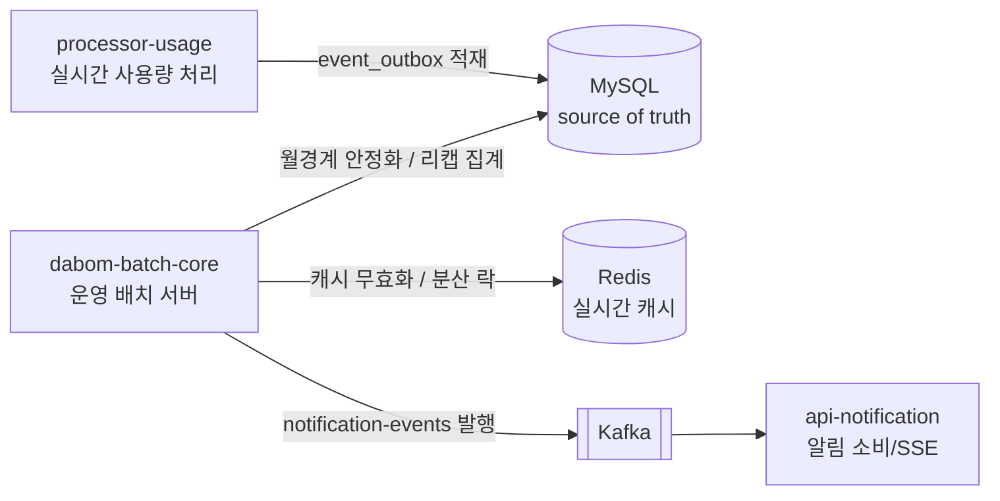
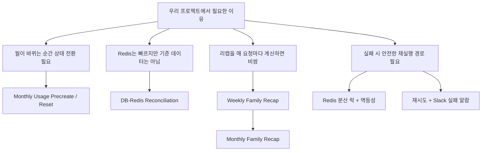
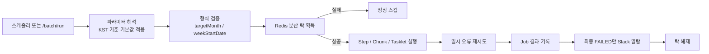
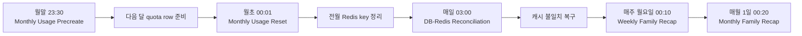
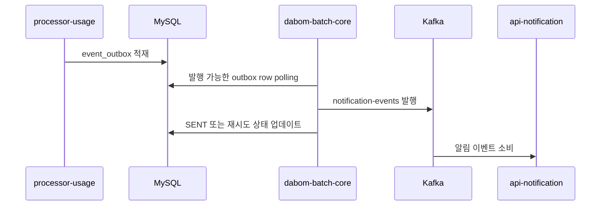
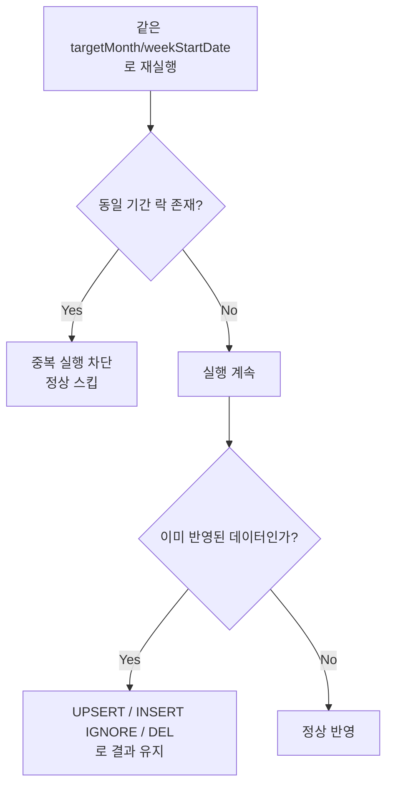

# DABOM-BATCH-CORE ✨

<p align="center">
  
  
  
  
</p>

<p align="center">
  
  
  
  
</p>

---

`dabom-batch-core`는 DABOM 시스템의 배치 전용 서버다. 실시간 처리 계층이 해결하지 못하는 월경계 전환, DB-Redis 정합성 복구, 주간·월간 리캡 사전 집계, `usage_event_outbox` 후행 발행을 담당한다.

즉, 이 모듈은 "가끔 도는 보조 작업"이 아니라 운영 안정성과 사용자 리포트 품질을 유지하는 핵심 운영 계층이다.

## 📌 DABOM-BATCH-CORE가 하는 일

- 🗓️ 월말에 다음 달 `customer_quota`와 `family_quota`를 미리 만들어 월초 첫 이벤트를 안전하게 처리한다.
- 🧹 월초에 전월 Redis 키를 정리해 월경계 캐시를 안정화한다.
- 🧭 DB를 기준으로 Redis 캐시를 무효화해 정합성 불일치를 복구한다.
- 📊 주간/월간 가족 리캡을 미리 생성해 API가 무거운 집계를 실시간으로 하지 않게 만든다.
- 🔔 `processor-usage`가 적재한 `usage_event_outbox`를 읽어 `notification-events` 토픽으로 후행 발행한다.



## 🤔 왜 별도 배치 서버가 필요한가



## ⚙️ 핵심 Job

### 🧱 운영 핵심 5개

| Job | 기본 스케줄 (KST) | 기본 파라미터 | 주된 읽기 소스 | 주된 쓰기 대상 | 역할 |
| --- | --- | --- | --- | --- | --- |
| `monthly-usage-precreate-job` | 매월 월말 23:30 (`0 30 23 28-31 * *`) | `targetMonth=다음 달 1일` | `customer`, `family`, `customer_quota`, `family_quota` | `customer_quota`, `family_quota` | 다음 달 quota row 선생성 |
| `monthly-usage-reset-job` | 매월 1일 00:01 (`0 1 0 1 * *`) | `targetMonth=이번 달 1일` | `family_member` 등 대상 목록, Redis 월 suffix 키 | Redis family/customer 월 키 | 전월 Redis 키 정리 |
| `db-redis-reconciliation-job` | 매일 03:00 (`0 0 3 * * *`) | `targetMonth=이번 달 1일` | MySQL 기준 가족/구성원 목록 | Redis family/customer 월 키 | DB 기준 캐시 무효화 |
| `weekly-family-recap-job` | 매주 월요일 00:10 (`0 10 0 * * MON`) | `weekStartDate=직전 주 월요일` | `usage_record`, `mission`, `appeal`, `family_quota` | `family_recap_weekly` | 주간 가족 리캡 생성 |
| `monthly-family-recap-job` | 매월 1일 00:20 (`0 20 0 1 * *`) | `targetMonth=직전 달 1일` | `family_recap_weekly`, 보강 raw 집계, `family_quota` | `family_recap_monthly` | 월간 가족 리캡 생성 |

### 🛠️ 운영 보조 1개

| Job | 기본 스케줄 (KST) | 기본 파라미터 | 주된 읽기 소스 | 주된 쓰기 대상 | 역할 |
| --- | --- | --- | --- | --- | --- |
| `event-outbox-publish-job` | 기본 비활성화, 활성화 시 fixed delay 60초 / initial delay 5초 | 없음 | `event_outbox` | Kafka `notification-events`, outbox 상태 컬럼 | 알림 이벤트 후행 발행 및 재시도 |

### 🔎 Job별 포인트

| Job | 락/멱등성 포인트 | 비고 |
| --- | --- | --- |
| `monthly-usage-precreate-job` | `targetMonth` 기준 락 + 중복 생성 방지 SQL | 스케줄은 `28-31일`에 걸리지만 실제 월말인지 한 번 더 확인 |
| `monthly-usage-reset-job` | `targetMonth` 기준 락 + Redis DEL 재실행 안전 | DB row를 생성하지 않고 Redis 정리에 집중 |
| `db-redis-reconciliation-job` | `targetMonth` 기준 락 + 캐시 무효화 재실행 안전 | DB를 source of truth로 사용 |
| `weekly-family-recap-job` | 주차 기준 락 + 주간 UPSERT | `weekStartDate`는 월요일만 허용 |
| `monthly-family-recap-job` | `targetMonth` 기준 락 + 월간 UPSERT | 주간 스냅샷 재사용 + 부족분 raw 보강 |
| `event-outbox-publish-job` | outbox row 상태 전이로 재시도 제어 | 다른 5개처럼 기간 파라미터 기반 Redis 락을 쓰지 않음 |

## 🔄 공통 실행 흐름

스케줄러와 수동 실행은 같은 `BatchJobLauncher`를 통해 동일한 규칙으로 동작한다.



### 🚨 재시도와 알람

- 기본 재시도 설정은 `batch.yml` 기준 `3회`, backoff `3000ms`다.
- 재시도 대상은 DB 데드락, DB 쿼리 타임아웃, Redis 연결 실패 일부 step이다.
- Slack 알람은 중간 실패가 아니라 `BatchStatus.FAILED` 최종 실패일 때만 보낸다.
- 스케줄러가 Job launch 전에 실패한 경우는 Job 실패 알람과 별도로 스케줄러 실패 알람을 보낸다.

## 📆 월경계 운영 흐름



핵심 의도는 이렇다.

- `Precreate`는 월이 바뀌기 전에 다음 달 row를 준비한다.
- `Reset`은 DB를 건드리지 않고 전월 Redis 상태만 정리한다.
- `Reconciliation`은 DB 기준으로 Redis를 비워 다음 조회/워밍업에서 올바른 상태를 다시 적재하게 만든다.
- `Weekly`와 `Monthly`는 API가 직접 계산하지 않도록 리캡 결과를 미리 생성한다.

## 📤 Outbox 후행 발행 흐름



이 Job은 다음 책임을 가진다.

- `PUBLISH_PENDING` 또는 재시도 가능한 실패 건을 polling한다.
- 병렬 executor로 payload를 Kafka에 발행한다.
- 성공 시 `SENT`, 재시도 가능 시 다음 시각 예약, 최종 실패 시 `FAILED`로 상태를 바꾼다.

## 🛡️ 재실행 안전성



- 락 키는 `lockPrefix:{period}` 형태로 기간 파라미터를 포함한다.
- 동일 월/주에 대한 병렬 실행은 락으로 막고, 같은 기간 재실행은 UPSERT/조건부 INSERT/DEL로 안전하게 처리한다.
- 이 설계 때문에 수동 복구 실행과 스케줄 실행이 같은 날 겹쳐도 데이터 파손 가능성을 낮춘다.

## 🧪 실행 및 개발 가이드

### 1. 로컬 실행 준비

```bash
cp .env.example .env
docker-compose up -d
./gradlew bootRun
```

PowerShell에서는 `Copy-Item .env.example .env`를 사용할 수 있다.

필수 전제는 다음과 같다.

- Java 21
- MySQL
- Redis
- 필요 시 Kafka bootstrap server

기본 설정 파일:

- [`application.yml`](C:/Users/student/ureca-final/project/dabom-batch-core/src/main/resources/application.yml)
- [`batch.yml`](C:/Users/student/ureca-final/project/dabom-batch-core/src/main/resources/batch.yml)
- [`mysql.yml`](C:/Users/student/ureca-final/project/dabom-batch-core/src/main/resources/mysql.yml)
- [`redis.yml`](C:/Users/student/ureca-final/project/dabom-batch-core/src/main/resources/redis.yml)

### 2. 왜 `spring.batch.job.enabled=false`가 기본값인가

이 애플리케이션은 "컨테이너가 기동되면 곧바로 종료하는 1회성 batch runner"가 아니라, 웹 서버와 스케줄러를 함께 띄우는 장기 실행 서비스다.

- 기본값은 `BATCH_JOB_ENABLED=false`
- 따라서 앱 시작 시 Spring Batch auto-run은 비활성화된다.
- 실제 실행 경로는 두 가지다.
  - `@Scheduled`
  - 운영 수동 실행 API `/batch/run`

### 3. 자주 쓰는 명령

```bash
./gradlew test
./gradlew build
./gradlew bootRun
```

## 🎛️ 수동 실행 API

외부 운영 도구나 관리자 요청으로 배치를 수동 트리거할 수 있다.

- Method: `POST`
- Path: `/batch/run`
- Body: `jobName` + `params`
- Response: `202 Accepted` + `jobExecutionId`

```json
{
  "jobName": "monthly-usage-precreate-job",
  "params": {
    "targetMonth": "2026-04-01"
  }
}
```

```json
{
  "jobExecutionId": 12345,
  "jobName": "monthly-usage-precreate-job",
  "status": "STARTING",
  "message": "Batch job accepted"
}
```

배치 실행은 비동기로 시작되며, 실제 완료 여부는 상태 조회 API로 확인한다.

- Method: `GET`
- Path: `/batch/jobs/{jobExecutionId}`

```json
{
  "jobExecutionId": 12345,
  "jobName": "monthly-usage-precreate-job",
  "status": "COMPLETED",
  "createTime": "2026-03-19T15:23:29",
  "startTime": "2026-03-19T15:23:29",
  "endTime": "2026-03-19T15:24:47",
  "exitCode": "COMPLETED",
  "exitDescription": null
}
```

### 🧾 지원 `jobName`

- `monthly-usage-precreate-job`
- `monthly-usage-reset-job`
- `db-redis-reconciliation-job`
- `weekly-family-recap-job`
- `monthly-family-recap-job`
- `event-outbox-publish-job`

### 🧩 파라미터 규칙

| 파라미터 | 형식 | 규칙 | 기본값 |
| --- | --- | --- | --- |
| `targetMonth` | `yyyy-MM-01` | 반드시 해당 월 1일이어야 함 | Job마다 다름 |
| `weekStartDate` | `yyyy-MM-dd` | 월요일만 허용 | 직전 주 월요일 |
| `launchTime` | epoch millis | 미지정 시 launcher가 자동 추가 | 자동 생성 |

### 📅 Job별 기본 파라미터

| Job | 기본값 |
| --- | --- |
| `monthly-usage-precreate-job` | 다음 달 1일 |
| `monthly-usage-reset-job` | 현재 월 1일 |
| `db-redis-reconciliation-job` | 현재 월 1일 |
| `monthly-family-recap-job` | 직전 달 1일 |
| `weekly-family-recap-job` | 직전 주 월요일 |
| `event-outbox-publish-job` | 없음 |

### ✍️ 수동 실행 예시

주간 리캡:

```json
{
  "jobName": "weekly-family-recap-job",
  "params": {
    "weekStartDate": "2026-03-09"
  }
}
```

월간 리캡:

```json
{
  "jobName": "monthly-family-recap-job",
  "params": {
    "targetMonth": "2026-02-01"
  }
}
```

Outbox 발행:

```json
{
  "jobName": "event-outbox-publish-job",
  "params": {}
}
```

## 🔑 주요 환경설정 키


### 🌐 공통

| 키 | 의미 | 기본값 |
| --- | --- | --- |
| `BATCH_JOB_ENABLED` | 앱 시작 시 Spring Batch auto-run 여부 | `false` |
| `BATCH_RETRY_LIMIT` | 공통 재시도 횟수 | `3` |
| `BATCH_RETRY_BACKOFF_MILLIS` | 공통 backoff | `3000` |
| `SLACK_WEBHOOK_URL` | 최종 실패 알람 Webhook | 빈 값 |

### ⏰ 스케줄 제어

| 키 | 의미 | 기본값                 |
| --- | --- |---------------------|
| `BATCH_WEEKLY_FAMILY_RECAP_ENABLED` | 주간 리캡 스케줄 활성화 | `true`              |
| `BATCH_WEEKLY_FAMILY_RECAP_CRON` | 주간 리캡 cron | `0 10 0 * * MON`    |
| `BATCH_MONTHLY_FAMILY_RECAP_ENABLED` | 월간 리캡 스케줄 활성화 | `true`              |
| `BATCH_MONTHLY_FAMILY_RECAP_CRON` | 월간 리캡 cron | `0 20 0 1 * *`      |
| `BATCH_MONTHLY_USAGE_PRECREATE_ENABLED` | 월말 선생성 스케줄 활성화 | `true`              |
| `BATCH_MONTHLY_USAGE_PRECREATE_CRON` | 월말 선생성 cron | `0 30 23 28-31 * *` |
| `BATCH_MONTHLY_USAGE_RESET_ENABLED` | 월초 정리 스케줄 활성화 | `true`              |
| `BATCH_MONTHLY_USAGE_RESET_CRON` | 월초 정리 cron | `0 1 0 1 * *`       |
| `BATCH_DB_REDIS_RECONCILIATION_ENABLED` | 정합성 복구 스케줄 활성화 | `true`              |
| `BATCH_DB_REDIS_RECONCILIATION_CRON` | 정합성 복구 cron | `0 0 3 * * *`       |
| `BATCH_EVENT_OUTBOX_ENABLED` | outbox 발행 스케줄 활성화 | `true`              |
| `BATCH_EVENT_OUTBOX_FIXED_DELAY` | outbox 발행 fixed delay | `60000`             |
| `BATCH_EVENT_OUTBOX_INITIAL_DELAY` | outbox 발행 initial delay | `5000`              |

### 🧰 Job 튜닝

| 계열 | 대표 키 |
| --- | --- |
| lock TTL | `BATCH_*_LOCK_TTL` |
| chunk 크기 | `BATCH_*_CHUNK_SIZE` |
| DB fetch 크기 | `BATCH_*_DB_FETCH_SIZE` |
| Redis 청크 크기 | `BATCH_*_REDIS_CHUNK_SIZE` |
| outbox 발행 튜닝 | `BATCH_EVENT_OUTBOX_BATCH_SIZE`, `BATCH_EVENT_OUTBOX_CONCURRENCY`, `BATCH_EVENT_OUTBOX_MAX_RETRY` 등 |

## 🗂️ 코드 구조


### 🧱 패키지 맵

| 경로 | 역할 |
| --- | --- |
| `api/` | `/batch/run` 수동 실행 인터페이스 |
| `common/` | launcher, alert, retry, scheduling, 공통 listener/support |
| `jobs/usageprecreate` | 다음 달 quota row 선생성 |
| `jobs/usagereset` | 전월 Redis key 정리 |
| `jobs/reconciliation` | DB 기준 Redis 무효화 |
| `jobs/recap/weekly` | 주간 가족 리캡 생성 |
| `jobs/recap/monthly` | 월간 가족 리캡 생성 |
| `jobs/eventoutbox` | `event_outbox` 후행 발행 |
| `resources/*.yml` | MySQL/Redis/Batch/로그 설정 |

## ⚠️ 운영 시 주의사항

- 분산 락은 Redis를 사용하며, 기간 파라미터를 포함한 키로 동일 월/주 병렬 실행을 막는다.
- 파라미터 기본값은 모두 KST(`Asia/Seoul`) 기준으로 계산된다.
- 문서보다 코드가 최신일 수 있으므로, 운영 판단의 source of truth는 항상 코드와 `batch.yml`이다.
- `monthly-usage-precreate-job`은 cron만 보면 28~31일에 실행되지만, 코드에서 "실제 월말"인지 다시 검증한다.

## 🔗 관련 문서

- [다봄 프로젝트 소개](https://github.com/da-bom)
